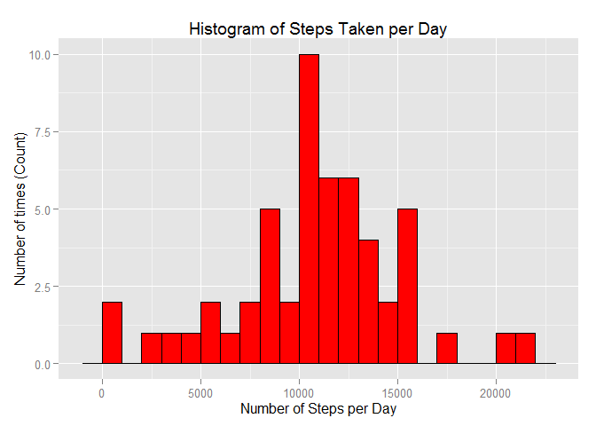
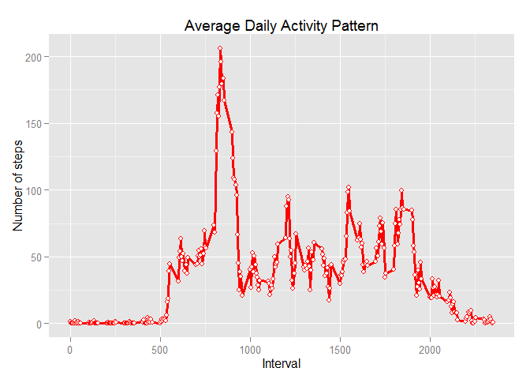
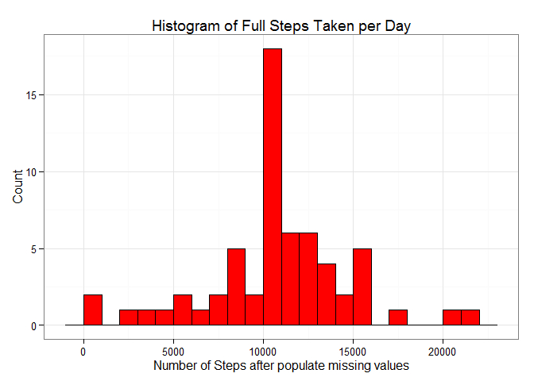
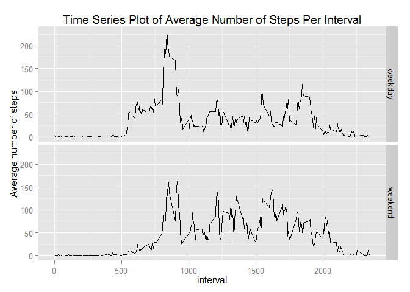

# Reproducible Research: Peer Assessment 1


## Loading and preprocessing the data

```r
getwd()
```

```
## [1] "C:/Users/Ronald/Documents/R_CLASS/R_CLASS"
```

```r
setwd("c:/Users/Ronald/Documents/R_CLASS/R_CLASS")
activity <- read.csv("activity.csv")
library(ggplot2)
library(lattice)
```


## What is mean total number of steps taken per day?


```r
steps.date <- aggregate(steps ~ date, data=activity, FUN=sum)
ggplot(steps.date, aes(x=steps)) + 
       geom_histogram(colour="black", fill = "red", binwidth = 1000) + 
        labs(title="Histogram of Steps Taken per Day", 
             x = "Number of Steps per Day", y = "Number of times (Count)")         
```

 


```r
mean(steps.date$steps)
```

```
## [1] 10766.19
```

```r
median(steps.date$steps)
```

```
## [1] 10765
```

## What is the average daily activity pattern?


```r
steps.interval <- aggregate(steps ~ interval, data=activity, FUN=mean)

ggplot(steps.interval, aes(x=interval, y=steps))+
         geom_line(colour="red", size=1.3) + geom_point(colour="red", size=2, shape=21, fill="white")+ labs(title="Average Daily Activity Pattern", x="Interval", y="Number of steps")
```

 


```r
steps.interval$interval[which.max(steps.interval$steps)]
```

```
## [1] 835
```

## Imputing missing values


```r
sum(is.na(activity))
```

```
## [1] 2304
```


```r
activity <- merge(activity, steps.interval, by="interval", suffixes=c("",".y"))
nas <- is.na(activity$steps)
activity$steps[nas] <- activity$steps.y[nas]
activity <- activity[,c(1:3)]
```


```r
steps.date <- aggregate(steps ~ date, data=activity, FUN=sum)
ggplot(steps.date, aes(x=steps)) + 
        geom_histogram(colour="black",fill="red", binwidth=1000) + 
        labs(title="Histogram of Full Steps Taken per Day", 
             x="Number of Steps after populate missing values", 
             y="Count") + 
        theme_bw() 
```

 


```r
mean(steps.date$steps)
```

```
## [1] 10766.19
```

```r
median(steps.date$steps)
```

```
## [1] 10766.19
```
## Are there differences in activity patterns between weekdays and weekends?


```r
library(lubridate)
activity$daytype <- as.factor(ifelse(wday(activity$date, label=TRUE) %in% c("Sat", "Sun"), "weekend", "weekday"))
FT <- split(activity, activity$daytype)

avsteps.weekday <- data.frame(tapply(FT$weekday$steps, FT$weekday$interval, mean))
avsteps.weekend <- data.frame(tapply(FT$weekend$steps, FT$weekend$interval, mean))

names(avsteps.weekday) <- "steps"
names(avsteps.weekend) <- "steps"

avsteps.weekday$interval <- as.integer(row.names(avsteps.weekday))
avsteps.weekend$interval <- as.integer(row.names(avsteps.weekend))

avsteps.weekday$daytype <- factor(rep("weekday", nrow(avsteps.weekday)), levels=c("weekday", "weekend"))
avsteps.weekend$daytype <- factor(rep("weekend", nrow(avsteps.weekend)), levels=c("weekday", "weekend"))


avsteps.bind <- rbind(avsteps.weekday, avsteps.weekend)
```


```r
# create a plot using ggplot
ggplot(avsteps.bind) + aes(x=interval, y=steps) + facet_grid(daytype ~ .) + geom_line() + labs(title="Time Series Plot of Average Number of Steps Per Interval", y="Average number of steps")
```

 


